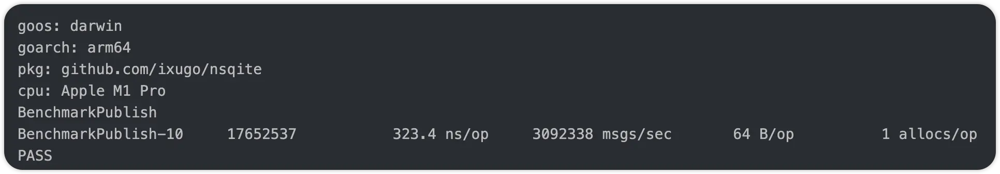
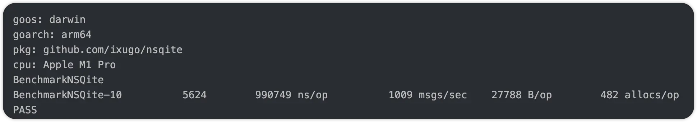

<p align="center">
    
</p>


[中文](./README_CN.md) [English](./README.md)

A lightweight message queue implemented in Go, supporting SQLite, PostgreSQL, and ORM as persistent storage.

## Introduction

In the early stages of a project, you might not need large message queue systems like NSQ、NATs or Pulsar. NSQite provides a simple and reliable solution to meet basic message queue requirements.

NSQite supports multiple storage methods:
- SQLite as message queue persistence
- PostgreSQL as message queue persistence

NSQite's API design is similar to go-nsq, making it easy to upgrade to NSQ in the future for higher concurrency support.

Note: NSQite guarantees at-least-once message delivery, which means duplicate messages may occur. Consumers need to implement deduplication or idempotent operations.


## Quick Start

### Event Bus

Suitable for business scenarios in monolithic architectures, implemented in memory, supporting 1:N publisher-subscriber relationships, including task failure delay retry mechanism.

Use cases:
+ Monolithic architecture
+ Real-time notification to subscribers
+ Message compensation after service restart
+ Support for generic message bodies

Example scenario:
**When a system alert occurs, it needs to be recorded in the database and notified to clients via WebSocket**

1. Database logging module subscribes to the alert topic
2. WebSocket notification module subscribes to the alert topic
3. When an alert occurs, the publisher sends the alert message
4. Both subscribers process the message respectively

The event bus decouples modules, transforming imperative programming into an event-driven architecture.

About message ordering:
- When the subscriber goroutine count is 1 and the handler always returns nil, NSQite guarantees message ordering
- In other cases (concurrent processing or message retry), NSQite cannot guarantee message order

```go
type Reader1 struct{}

// HandleMessage implements Handler.
func (r *Reader1) HandleMessage(message *EventMessage[string]) error {
	time.Sleep(time.Second)
	fmt.Println("reader one :", message.Body)
	return nil
}

// Simulate an author writing books frantically, with 5 editors processing one book per second
func main() {
	const topic = "a-book"
	p := NewPublisher[string]()
	// Limit task failure retry attempts to 10 times
	c := NewSubscriber(topic, "comsumer1", WithMaxAttempts[string](10))
	c.AddConcurrentHandlers(&Reader1{}, 5)

	for i := 0; i < 5; i++ {
		// This function returns an error, but in normal pub/sub usage, errors are rare and can be ignored
		p.Publish(topic, fmt.Sprintf("a >> hello %d", i))
	}

	time.Sleep(2 * time.Second)
}
```

Manual completion
```go
type Reader3 struct {
	receivedMessages sync.Map
	attemptCount     int32
}

// HandleMessage implements Handler.
func (r *Reader3) HandleMessage(message *EventMessage[string]) error {
	// Disable auto-completion
	message.DisableAutoResponse()
	if message.Body == "hello" || message.Attempts > 3 {
		// Manual completion
		r.receivedMessages.Store(message.Body, true)
		message.Finish()
		return nil
	}
	// Manual retry after 1 second delay
	atomic.AddInt32(&r.attemptCount, 1)
	message.Requeue(time.Second)
	return nil
}
```

### Transactional Messages (In Development)

Database-based implementation, supporting GORM, with transactional message publishing, consisting of producers and consumers.

Use cases:
+ Monolithic or distributed architecture
+ Messages bound to database transactions, can be revoked when transaction rolls back
+ Fast message processing in monolithic architecture
+ Message delay of 100~5000ms in distributed architecture

Example scenario:
**When deleting a user, related data needs to be deleted simultaneously**

1. User profile module subscribes to user deletion topic
2. Publish transactional message within the user deletion transaction
3. After transaction commit, consumers receive and process the message
4. If server crashes during processing
5. After restart, consumers will receive and process the message again

Note: Messages may be triggered multiple times, consumers need to implement idempotent processing.

### Code Examples

#### Basic Usage
```go
type Reader1 struct{}

// HandleMessage implements Handler.
func (r *Reader1) HandleMessage(message *EventMessage[string]) error {
	time.Sleep(time.Second)
	fmt.Println("reader one :", message.Body)
	return nil
}

// Simulate an author writing books frantically, with 5 editors processing one book per second
func main() {
	// 1. SetGorm
	nsqite.SetGorm(db)

	const topic = "a-book"
	p := NewProducer[string]()
	// 限制任务失败重试次数 10 次
	c := NewConsumer(topic, "comsumer1")
	c.AddConcurrentHandlers(&Reader1{}, 5)
	for i := 0; i < 5; i++ {
		// 此函数会返回 err，正常使用发布订阅不会出错，可以直接丢弃 err 不处理
		p.Publish(topic, fmt.Sprintf("a >> hello %d", i))
	}

	time.Sleep(2 * time.Second)
}
```

#### Manual Message Control
```go
type Reader3 struct {
	receivedMessages sync.Map
	attemptCount     int32
}

// HandleMessage implements Handler.
func (r *Reader3) HandleMessage(message *EventMessage[string]) error {
	// Disable auto-completion
	message.DisableAutoResponse()
	if message.Body == "hello" || message.Attempts > 3 {
		// Manual completion
		r.receivedMessages.Store(message.Body, true)
		message.Finish()
		return nil
	}
	// Manual retry after 1 second delay
	atomic.AddInt32(&r.attemptCount, 1)
	message.Requeue(time.Second)
	return nil
}
```

### Maintenance and Optimization

NSQite uses slog for logging. If you see the following warning logs, you need to optimize parameters promptly:

- `[NSQite] publish message timeout`: Indicates publishing is too fast for consumers to handle. Optimize by:
  - Increasing cache queue length
  - Increasing concurrent processing goroutines
  - Optimizing consumer handler performance

Default timeout is 3 seconds. If timeouts occur frequently, adjust the timeout using `WithCheckTimeout(10*time.Second)`.

## Benchmark

**Event Bus**

One publisher, one subscriber, 3 million concurrent messages per second


**Transactional Message Queue**

One producer, one consumer, based on SQLite database, performance is barely satisfactory. PostgreSQL will provide better performance


## Next Development Tasks

- Event Bus support for Redis as persistent storage, enabling distributed deployment
- Transactional Message Queue support for distributed deployment, where consumers update the database after receiving messages
